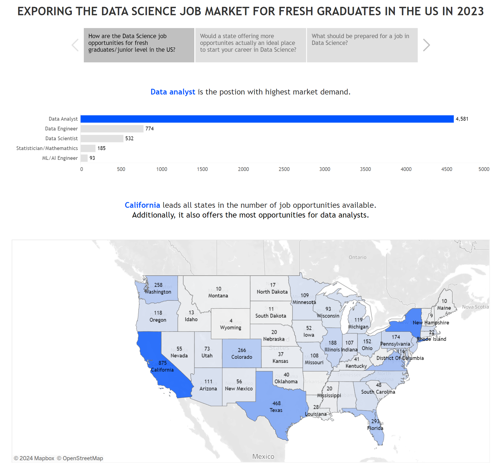
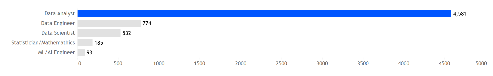
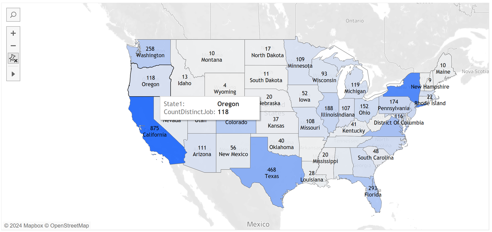
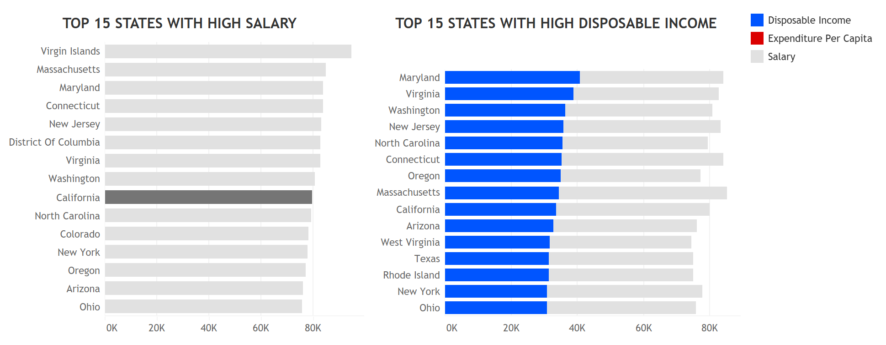
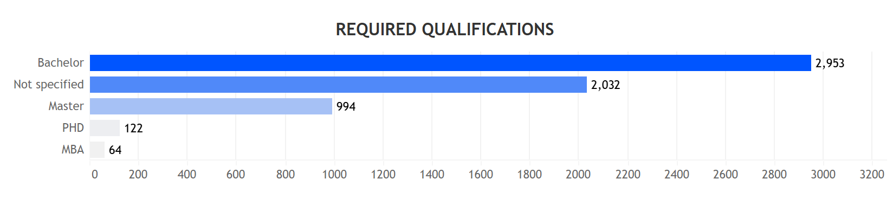
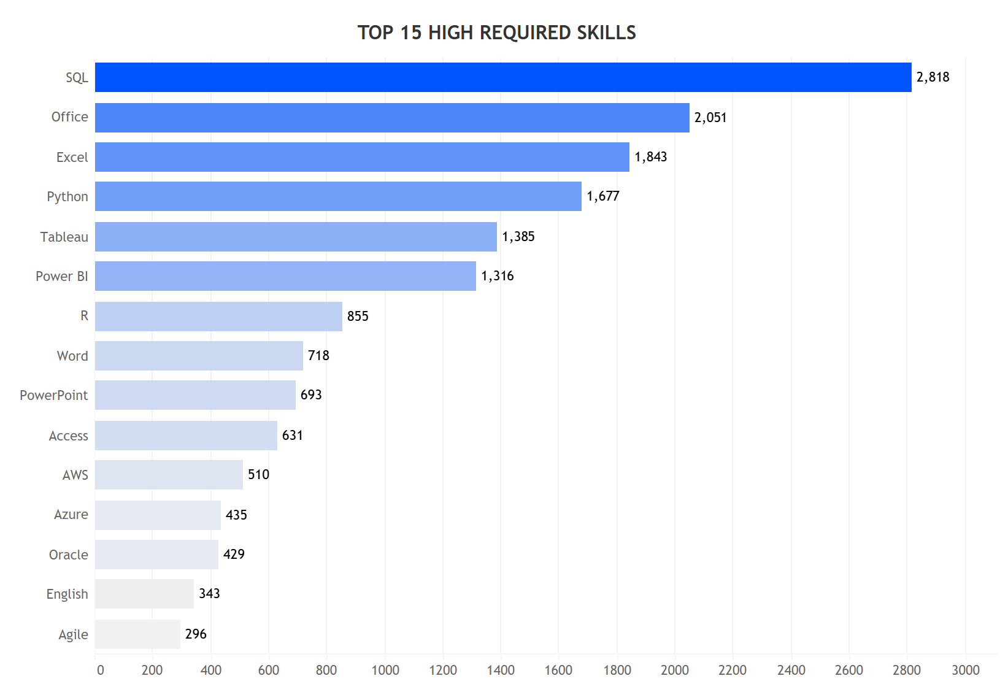
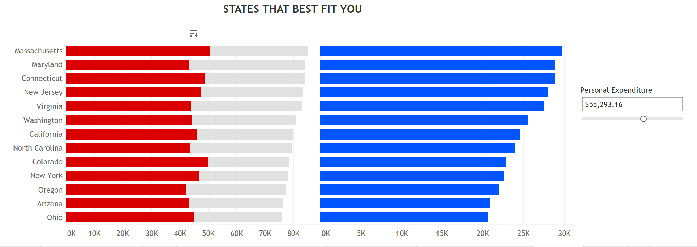
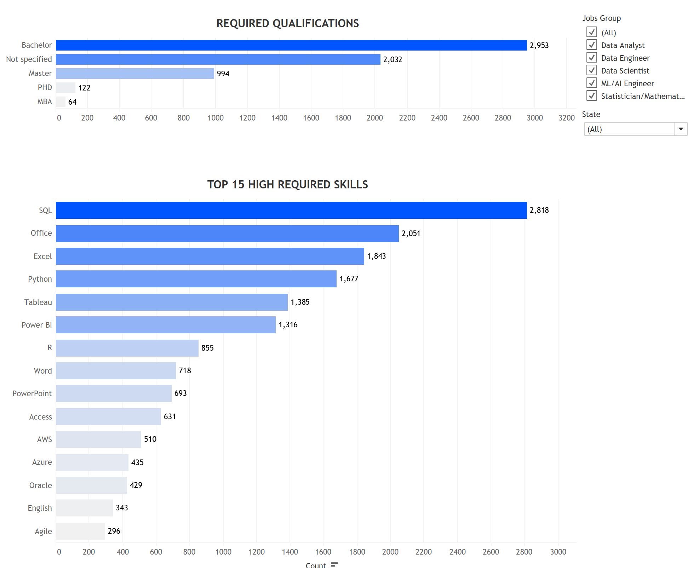

# EXPLORING THE DATA SCIENCE JOB MARKET FOR FRESH GRADUATES IN THE US IN 2023

## 1. Project Introduction
**Goal**

- The purpose of this project is to thoroughly explore the data science job market in the US for the year 2023, aiming to uncover key insights and trends. These findings are intended to provide valuable guidance and actionable strategies for fresh graduates seeking to secure their first job in the data science field.

**Targeted Audience**

- Fresh graduates from Data Science related programs in the US

**Link to publised dashboard:** [**HERE**](https://public.tableau.com/views/DataScienceJobMarket2023_FreshGraduates/Story1?:language=en-US&publish=yes&:sid=&:redirect=auth&:display_count=n&:origin=viz_share_link)

## 2. The Dataset
The final dataset is combined from 2 sources:
- U.S. Bureau of Labor Statistics. (2024, May 2). Consumer Expenditure Survey. U.S. Bureau of Labor Statistics. https://www.bls.gov/cex/tables.htm#topline 
- Asaniczka. (2024, February 6). Data Science Job Postings & Skills. Kaggle. https://www.kaggle.com/datasets/asaniczka/data-science-job-postings-and-skills 

**Meta Data**
- **ID:** A unique identifier for each job posting
- **Job:** The title or designation of the job position
- **Jobs_Group:** A categorized grouping of similar job roles
- **Profile:** The candiate profile (e.g: junior, senior...)
- **Remote:** Indicates whether the job is remote, onsite or hybrid
- **Company:** The name of the company offering the job position
- **State:** The U.S. state where the job is located
- **ExpenditurePerCapita:** The average expenditure per capita in the state where the job is located
- **Low_Salary:** The lower bound of the salary range offered for the job
- **High_Salary:** The upper bound of the salary range offered for the job
- **Mean_Salary:** The average salary offered for the job position
- **Education_level:** The required or preferred level of education for the job (e.g., Bachelor's, Master's, PhD...)
- **Skills1-22:** Skills required for the role

## 3. Analysis and key findings
Data showed that Data analyst is the position with highest market demand in the US in 2023.

California leads all states in the number of job opportunities available. It also offers the most opportunities for data analyst role.

However, California or any state that offers more job opportunities is not actually an ideal place to start your career in data science. By taking into account the Salary and diposable income into consideration, our findings indicate that despite the promising number of job opportunities, California ranks among the middle group in terms of both high salaries and disposable income. 

Other states—such as Maryland, New Jersey, and Virginia—though with fewer opportunities available, seem more promising with their higher rankings. 

As such, it is recommended that graduates should weigh the abundance of opportunities against the cost of living and potential earnings. Opting for states with a balanced offering of job opportunities and financial benefits can lead to a more sustainable and rewarding career path.

Regarding qualifications and skills required for the field, overall, around one half of the opportunities require at least a bachelor's degree. However, it is worth noting that for around one-third samples in ourdataset, the qualification requirement was not specified. One of the possible reasons for that could be employers are willing to consider candidates who may not have traditional educational backgrounds but possess strong relevant skills and practical experience.

On the other hand, SQL, Office, Excel, Python, Tableau, and PowerBI are among the top highly perferred practical skills by employers. This is implied that candiates with or without relevant qualifications both should leverage their hands-on experience and build strong portfolios showcasing their proficiency in those skills to stay competitive. 

## 4. Getting valuable insinghts for your specific profile and needs
- The dashboard provides a space for users to actively interact with the research journey to find the states that best fit them
- Users can customize their budgets for different categories such as housing, transportation, food, insurance and pensions, and others, to calculate the total personal expenditure. The list of states is then filtered to those with average expenditures approximately equal to the user’s total annual expenditure displayed.

- Users can also use the filter to see the specific requirements of skills and qualification by job position and/or by location.
  

